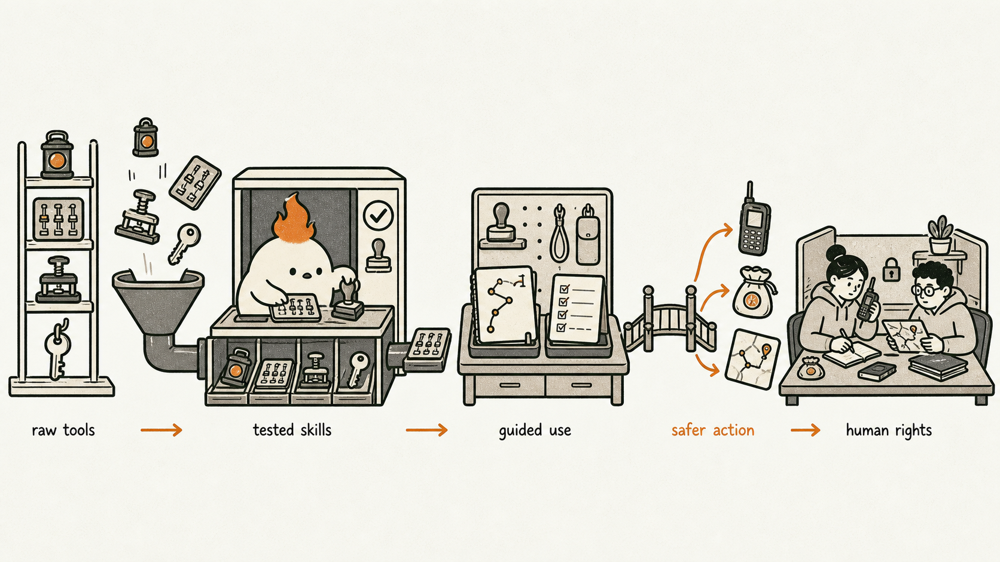
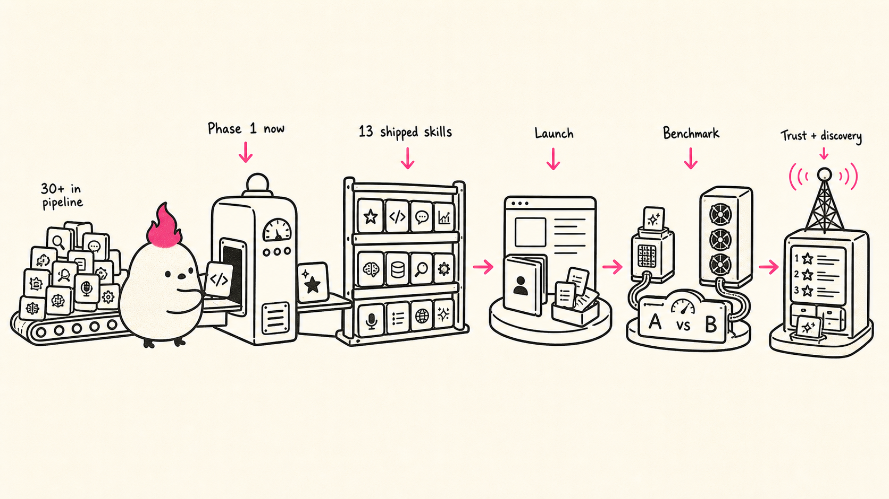
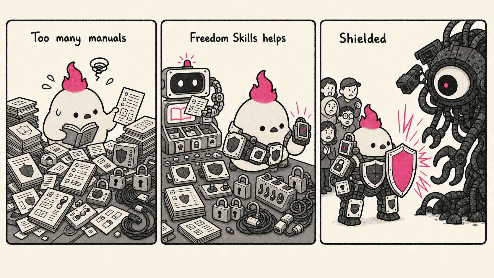

# Freedom Skills Progress Report for HRF

Prepared by: Breno Brito

Period covered: Q1 of 4 (April 1, 2026 to July 1, 2026)

*Figure: Freedom Skills as a flow from raw tools to tested skills, guided use, safer action, and ultimately human-rights work.*

## Executive Summary

Since April, Freedom Skills has moved from grant planning into a public repository with shipped skills, validation infrastructure, tests, and an active pipeline of freedom-tech work. The work completed during this reporting period falls into three phases:

1. April: strategy, landscape mapping, benchmark research, and early research on skill discovery and trust architecture.
2. May to mid-June: public repo setup, first shipped skills, and quality-control foundations.
3. Late June to July 1: security/privacy infrastructure, additional shipped skills, and a larger branch queue for advanced or experimental skills.

As of July 1, the `main` branch contains 13 skill directories and supporting repository infrastructure. In parallel, at least 30 additional skill directories exist across active branches and worktrees. These branch-only skills include work around BitChat, GPG, OpenTimestamps, Hosted Nowhere, and other privacy- or resilience-oriented workflows.

## What Was Completed

### 1. Strategic research and roadmap work

The first phase focused on defining what Freedom Skills should be for and which users it should prioritize.

This included:

- a roadmap oriented around real user goals such as access to information, preservation, secure communications, sovereign money, offline operation, and censorship resistance
- a freedom-tech landscape review covering Bitcoin-adjacent tools, messaging systems, privacy tools, and resilience infrastructure
- a research pass on skill discovery, ranking, trust, and federated discovery, including Nostr-aligned trust ideas
- a benchmarks landscape and an initial benchmark strategy for evaluating skill quality, portability, safety, and usefulness

### 2. Public repository setup and validation workflow

In May, the project was turned into an active public repository with a repeatable contribution and validation workflow.

Completed repository work included:

- creation of the public `freedom-skills` repository
- repository README and project framing
- a CI workflow that validates touched skills in pull requests
- a pre-commit validation flow for skill references
- ongoing revisions to keep skill workflows more action-first and less onboarding-heavy

### 3. Skills shipped to the main branch

The current `main` branch includes 13 shipped skills at this stage. They are:

- `signal-cli` allows AI agents to use Signal for private messaging workflows.
- `nostr-cli` allows AI agents to use Nostr for censorship-resistant publishing workflows.
- `p2p-transfer-filepizza` allows AI agents to share files through temporary peer-to-peer urls.
- `timelock-sh` allows agents to time-lock files for controlled future access.
- `fast-transcript` allows agents to transcribe and inspect audio or video locally.
- The Money Dev Kit skill set (`mdk-agent-wallet`, `mdk-l402-api`, `mdk-mcp`, `mdk-nextjs-checkout`, and `mdk-replit-checkout`) consists of five official MDK skills that help builders integrate Bitcoin and Lightning payments into their apps.
- `mo-ux-vibedesign-btc` brings senior Bitcoin UX review into the repository.
- The Rampart hook pair and `rampart-hook-configurator` help reduce accidental sharing of personal and sensitive information in agent workflows.
- `domain-intel` gives agents a passive domain reconnaissance workflow.

### 4. Testing and safety infrastructure

The repository also includes executable tooling and tests.

Completed work in this area includes:

- automated tests for skills with real scripts, including `p2p-transfer-filepizza`, `timelock-sh`, and `domain-intel`
- a tested Rampart pre-send/post-send hook pair for reducing privacy exposure during agent use
- `rampart-hook-configurator` to help install and use that protection layer
- frontmatter and portability research to make skills cleaner across agent ecosystems

## Active Branches and Worktrees

A large share of recent work is still in active branches and worktrees and has not yet been merged into `main`.

Active branch/worktree efforts include:

- `bitchat`
- `gpg`
- `ark-vtxo-inspector`
- `opentimestamps`
- `hosted-nowhere`
- `bitcoin-pir`
- `openauspex`
- `hyperdrive`
- `iroh`
- `nostr-vpn`
- `stegg`

This queue covers secure messaging, cryptographic verification, private publishing, file transfer, discovery, and related freedom-tech infrastructure. The next need is a stronger merge and release cadence so more of this work becomes published and usable.

## Progress Against the Original Proposal Success Measures

The original proposal described success using four measures: the number of high-quality skills published, the number of ecosystem teams contributing or collaborating, the number of developers, organizations, and open-source projects using the skills, and positive feedback showing that the skills reduce friction in real workflows. This quarter is still better described qualitatively than quantitatively, because most of the work went into building the foundation. The proposal measures can still be reviewed in a first pass.

### 1. Number of high-quality skills published

Published skill count is the clearest area of progress so far.

The repository's `main` branch now contains 13 skill directories, alongside validation workflows, tests for selected scripted skills, and supporting infrastructure such as hooks. A larger branch-only pipeline is also under active development.

### 2. Number of ecosystem teams contributing or collaborating

Collaboration is still early.

During this period, I attended Oslo Freedom Forum and established contact with other entities, grantees, and activists working in the freedom space. Some of those relationships already led to direct technical support. I have been helping some activists with vibe coding and agentic engineering work. Other conversations focused on repository collaboration, including adding skills connected to projects such as Money Dev Kit and Mo VibeDesign UX for Bitcoin.

There are still other relationships made I intend to get back to once I finish this first phase of the project. Over the full 12-month grant period, I expect to deepen those contacts and turn more of them into active collaboration around skill creation, refinement, and adoption.

### 3. Number of developers, organizations, and open-source projects using the skills

Usage is still early. The repository is public and usable, and the project has already had an initial public release through Twitter and LinkedIn, but it has not yet had the broader distribution effort planned for Bitcoin-native communities, freedom-related spaces, and general launch channels.

There are already a few public signals of interest. As of July 5, 2026, the public GitHub repository shows 11 stars and 1 fork. Those numbers are small, but they suggest outside interest before a formal launch.

### 4. Positive feedback showing reduced friction in real workflows

Feedback is still informal.

Most of the evidence so far comes from building and testing the skills: where agents get stuck, which tools need wrappers, and which workflows need safety layers. External feedback is still limited.

## Main Lessons From This Period

- Skills work best when they are action-first and tied to concrete user goals, so it's important to talk to activists to understand their real needs.
- Many useful tools are built for humans, not for agents. Some have strong graphical interfaces but weak programmatic ones. That is why part of the work has become building CLI layers and wrappers for tools such as FilePizza, Nowhere, and BitChat.
- Broad infrastructure matters. Hooks, MCP-oriented workflows, and configuration tooling also deserve attention.
- Curation matters alongside creation. The library needs selection, evaluation, refinement, and organization in addition to new entries.

## Broader Project Roadmap

The Freedom Skills roadmap has four phases.

The diagram below summarizes that sequence and shows the current position of the project: Phase 1, focused on turning a larger pipeline of skills into a stronger shipped base before launch, benchmarking, and trust/discovery work.

*Figure: Four-phase roadmap showing the current Phase 1 focus: converting a queue of 30+ skills into a stronger shipped base before launch, benchmarking, and trust/discovery work.*

### Phase 1: Kickstart the project with a strong initial skill base

The first phase is to curate and publish a base of high-value skills that are relevant to human rights, freedom-tech, and high-risk operational contexts. This is the current phase. Skill creation and curation will continue during all phases.

### Phase 2: Launch the project and open the collaboration loop

Once the repository has a large enough base of useful skills, the next phase is to expand the public launch through relevant media and community channels. The project has already had an initial public release through Twitter and LinkedIn. The next step is broader distribution in Bitcoin-native spaces such as Stacker News, freedom-related communities, and more general launch channels such as Product Hunt and Hacker News. This phase also includes a landing page, a user quickstart and install path, a guide for contributors, and concrete demos so outside users can understand the project, start using the skills, and begin contributing.

### Phase 3: Version, benchmark, and optimize the skills

After the project has a stronger skill base, the next step is to add a maintenance and evaluation layer. This phase includes skill versioning, benchmarking, and optimization.

There are roughly two kinds of optimization in this phase. The first is optimization of the `description` field in a skill's `SKILL.md` frontmatter, since in the Agent Skills model the `description` is the primary mechanism for triggering and deciding whether the skill gets loaded. This means improving triggering accuracy: making sure a skill triggers when it should, does not trigger when it should not, and remains precise without becoming too narrow or too broad.

The second is optimization of the skill's actual output quality and operational trade-offs. In Agent Skills terms, this means evaluating skill output quality through structured evals, comparing runs with and without the skill (or against previous versions), grading outputs against assertions, and tracking what the skill costs in time and tokens relative to the improvement it produces.

Benchmarking also matters because people will use these skills with very different models and harnesses. Some users will run them on smaller local models, while others will use more capable hosted models. They will also use different agent harnesses with different tool behavior and context handling. Benchmarking helps identify which combinations of skill, model, and harness are good enough to use in practice.

### Phase 4: Tackle trust and discovery

The final major phase is to address the trust and discovery part of the original project vision. This includes building better ways to rank, surface, and safely discover reliable skills. 

## Priorities for the Next Phase

The highest-value next steps are:

1. Merge and harden the strongest branch-only skills, especially the ones most aligned with secure communication, verification, and resilient publishing.
2. Continue curating and shipping a stronger prelaunch base of high-value skills.
3. Prepare the public launch materials, including the landing page, user quickstart, install path, contributor guide, and concrete demos.
4. Increase visibility and use: bring the project beyond the current soft launch into Bitcoin-native spaces, freedom-related communities, and general launch channels.

## Closing Summary

From April through July 1, Freedom Skills moved from proposal to public implementation. The project now has:

- a defined mission and roadmap
- a public repository
- shipped skills on the main branch
- validation and testing infrastructure
- a security/privacy hook system
- an active branch queue of additional freedom-tech skills

The project is still early, especially on benchmarking and trust/discovery. But the foundation is in place: Freedom Skills is now a public project with shipped work, supporting infrastructure, and a larger pipeline in progress.

*Figure: A visual summary of how Freedom Skills helps turn complex defensive tools into practical protection for high-risk users.*
